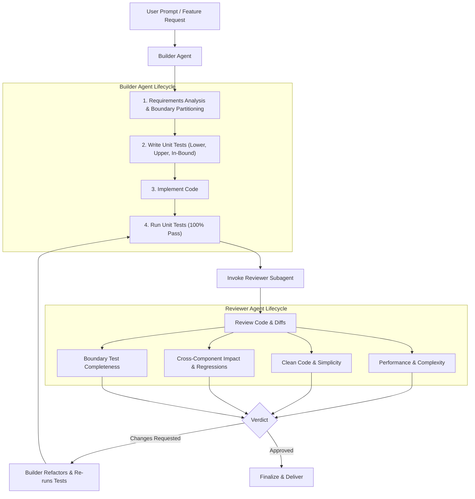

# Builder & Reviewer Agent Workflow

This skill guides the invocation and orchestration of the **Builder Agent** and **Reviewer Agent** for high-reliability, test-driven feature development and bug fixes.

---

## Architecture Flow



---

## How to Invoke the Agents

### 1. Involving the Builder Agent
When a feature, fix, or refactor is requested:
```typescript
invoke_subagent({
  Subagents: [{
    TypeName: "builder",
    Role: "Test-Driven Builder",
    Prompt: "Implement <feature/fix description> with comprehensive boundary unit tests."
  }]
});
```

### 2. Builder Invokes Reviewer
Once tests pass, the Builder Agent calls:
```typescript
invoke_subagent({
  Subagents: [{
    TypeName: "reviewer",
    Role: "Code Quality & Performance Reviewer",
    Prompt: "Review the code changes in <files> against performance, simplicity, and regression risks."
  }]
});
```
