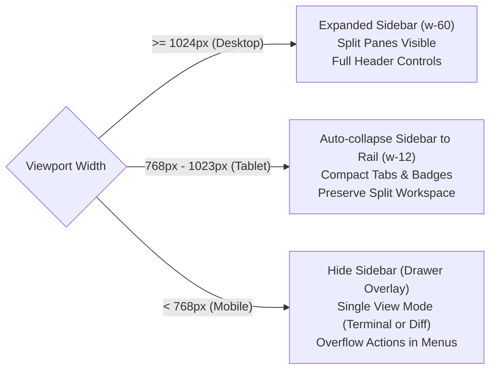
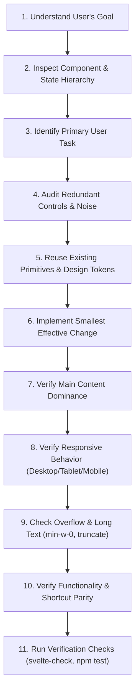

# 🎨 Reusable UI Development Skill: Simplicity, Responsiveness & Consistency

This skill guides AI agents and developers when designing, creating, modifying, or refactoring user interfaces in **AgentDeck**. It ensures that the application interface remains focused, visually calm, responsive, and strictly aligned with the existing Svelte 5 runes architecture and Tailwind styling system.

---

## 1. Core Principle: Simplicity Over Visual Complexity

> [!IMPORTANT]
> **Prefer simplicity over visual complexity.**  
> The UI must empower users to focus on their primary task: running AI coding agents, inspecting terminal output, reviewing diffs, and controlling Git state. Avoid unnecessary navigation layers, duplicated controls, excessive tabs, redundant status information, and visual clutter.

Every UI element must serve a distinct, demonstrable purpose. When designing or reviewing any UI component or view, always ask:

1. **Is this element necessary?** (Does removing it impede core functionality?)
2. **Can this information be grouped with related information?** (Can we eliminate scattered pills and badges?)
3. **Can this action be moved into a secondary menu?** (Does it need to be permanently visible?)
4. **Can the number of visible controls be reduced?** (Are we cluttering the header or toolbar?)
5. **Does this element compete with the primary content?** (Does it distract from the terminal or diff canvas?)
6. **Is there already another UI element performing the same function?** (Avoid duplicating actions across headers, toolbars, sidebars, and status bars.)

---

## 2. UI Simplification Rules

### 2.1. Reduce Navigation Layers
Avoid stacking multiple horizontal or vertical bars that all act as navigation. Maintain a clear 3-level hierarchy:

```
┌────────────────────────────────────────────────────────┐
│ Level 1: Primary Navigation (Header / Sidebar)         │
├────────────────────────────────────────────────────────┤
│ Level 2: Workspace / Session Navigation (Tabs)         │
├────────────────────────────────────────────────────────┤
│ Level 3: Main Content (Terminal Cockpit / Diff Canvas) │
└────────────────────────────────────────────────────────┘
```

- **Sidebar (`Sidebar.svelte`):** Dedicated to high-level application & project workspace navigation (`projects`, `workspaces`, `settings`).
- **Tabs (`TerminalView.svelte` tabs / Header view switcher):** Dedicated to active workspace context and open PTY terminal sessions.
- **Dropdowns / Menus (`MoreHorizontal` popovers):** Dedicated to secondary, contextual, or infrequently used navigation and actions.
- **NEVER** use tabs, sidebars, toolbars, and navigation bars redundantly for the same purpose.

### 2.2. Prioritize the Main Content
The primary workspace must receive the dominant visual weight and physical screen space:
- **Primary Content Areas:**
  - Embedded PTY Terminal Cockpit (`TerminalView.svelte`)
  - Real-Time File Changes & Myers Diff Review Canvas (`DiffView.svelte` / `FileList.svelte`)
  - Markdown Render Preview (`MarkdownPreview.svelte`)
  - Agent Steering Interaction Modal (`SteerModal.svelte`)
- Supporting controls, metadata badges, breadcrumbs, and gutters must remain visually lightweight and non-distracting.

### 2.3. Progressive Disclosure
Do not display every available action on screen simultaneously.
- **Permanently Visible:** High-frequency, critical primary actions (e.g., active workspace switcher, Commit staged button, New Terminal tab, Split view toggle).
- **Secondary / Overflow Disclosed:** Move secondary actions into:
  - Dropdown menus (`MoreHorizontal` popover menu in Header)
  - Context menus (Right-click / line actions in DiffView)
  - Modals / Command palettes (Settings `Ctrl+,`, Branch switcher `Ctrl+Shift+B`, Prompt Templates)
  - Expandable panels (Foldable file tree groups, collapsible diff context)

### 2.4. Group Related Actions
Colocate logically related controls together rather than scattering them across different corners of the viewport:
- **Git Actions:** Group Commit, Stage All, Branch Switcher, Push, Pull, and Stash within the Git domain cluster.
- **Project Navigation:** Group project selection, project attachment, and workspace detachment in the `Sidebar.svelte`.
- **Session Controls:** Group session tabs, split layout switches, and agent quick-launch options within `TerminalView.svelte`.
- **Application Settings & Theme:** Keep theme toggle and global preferences cleanly separated in sidebar footers or dedicated modals (`SettingsModal.svelte`), preventing competition with workspace actions.

### 2.5. Avoid Information Overload
Do not display technical metadata by default unless it is directly actionable.
- **Suppress by default:** Detailed internal IDs, full filesystem absolute paths (use tooltips for full paths and show truncated basenames), raw Git SHAs (show short 7-character SHAs only where relevant), secondary process exit codes, verbose hardware metrics.
- **Progressive disclosure for metadata:** Use clean tooltips (`title="..."` or accessible hover cards) for path details or keyboard shortcuts.
- **Show the minimum viable information** required for the user to understand the current application state.

### 2.6. Maintain Clear Visual Hierarchy
Each view must immediately communicate:
1. **Where the user is:** Clear active project name and branch pill in `Header.svelte` or `Sidebar.svelte`.
2. **What they are currently working on:** Active terminal session tab with distinct highlight, or selected diff file in `FileList.svelte`.
3. **What the primary action is:** Visually distinct call-to-action (e.g., green Commit button `bg-emerald-600` when staged changes exist).
4. **Which controls are secondary:** Subtle, neutral styling (`text-slate-500 hover:text-slate-900 dark:text-deck-muted dark:hover:text-deck-bright`, ghost buttons).

---

## 3. Recommended Application Layout Architecture

AgentDeck enforces a clean, calm, 5-zone application shell:

```
┌────────────────────────────────────────────────────────────────────────┐
│ 1. Top Header (h-11, compact, active workspace, view switch, primary) │
├───────────────┬────────────────────────────────────────────────────────┤
│               │ 3. Main Workspace Area (flex-1, min-w-0)               │
│ 2. Sidebar    │                                                        │
│ (Collapsible: │ ┌────────────────────────────────────────────────────┐ │
│  w-60 / w-12  │ │ 4. Minimal Workspace Tabs (h-9, session tabs, P1/P2)│ │
│  or Drawer)   │ ├────────────────────────────────────────────────────┤ │
│               │ │ Primary Content Canvas                             │ │
│               │ │ (Terminal Cockpit / Split Pane / Diff Viewer)      │ │
│               │ └────────────────────────────────────────────────────┘ │
├───────────────┴────────────────────────────────────────────────────────┤
│ 5. Minimal Status Bar (h-6, 24px, branch, sync status, active agents)   │
└────────────────────────────────────────────────────────────────────────┘
```

### Layout Shell Specification:
1. **Top Header (`Header.svelte`, `h-11`):**
   - Left: Sidebar toggle (`PanelLeft`), minimal logo, active workspace name + Git branch switcher pill.
   - Center: Segmented view switcher (`Terminal`, `Changes`, `Split`).
   - Right: Primary Git action (`Commit` / `Stage All`), refresh button, and `MoreHorizontal` secondary actions dropdown.
2. **Collapsible Workspaces Sidebar (`Sidebar.svelte`):**
   - Three responsive modes:
     - `expanded` (`w-60`): Workspace names, hotkeys (`Ctrl+1..9`), branch, agent status, and staging badges.
     - `rail` (`w-12`): Compact vertical icon rail with tooltips, perfect for tablet or screen space saving.
     - `hidden` (`w-0`): Fully collapsed on mobile or when user toggles `Ctrl+B`.
   - Mobile: Slides out as an accessible modal drawer (`< 768px`) with backdrop blur.
3. **Main Workspace Canvas (`App.svelte`, `main.flex-1.min-w-0`):**
   - Zero horizontal overflow.
   - Supports single terminal, single review canvas, or side-by-side split pane with draggable gutter (`w-1.5`).
   - Sessions remain mounted in DOM to prevent PTY teardown or agent process termination.
4. **Workspace Tabs (`TerminalView.svelte`, `h-9`):**
   - Horizontal scrolling tab deck (`overflow-x-auto no-scrollbar`).
   - P1 / P2 split pane indicators, agent bot badges (`🤖`), inline double-click renaming, and add tab (`+`).
   - Right-aligned layout mode toggles (`Single`, `Split H`, `Split V`) and quick-launch agent dropdown.
5. **Minimal Status Bar (`StatusBar.svelte`, `h-6`):**
   - Height: exactly `24px` (`h-6`), font size `11px` (`text-[11px] font-mono`).
   - Left: Truncated project name, branch link, ahead/behind sync counts (`↑1 ↓2`), dirty change count (`● 3 changes`), active agent indicator (`🤖 1 Agent Active`).
   - Right: View mode indicator, layout mode, line wrap toggle (`Alt+Z`), and quick shortcut hint.

---

## 4. Responsive Design System

The application must be fully responsive across desktop, tablet, and mobile displays without layout breakage or horizontal window scrolling.



### 4.1. Desktop (`>= 1024px`)
- Full sidebar can remain expanded (`w-60`).
- Terminal cockpit and Diff review canvas can render side-by-side in split pane mode.
- Primary and secondary actions can display text labels alongside icons.

### 4.2. Tablet (`768px` to `1023px`)
- Sidebar automatically collapses to the compact icon rail (`w-12`) via `handleResize()` in `App.svelte`.
- Header text labels on secondary buttons collapse into icon-only representations (`hidden md:inline`).
- Draggable split gutter preserves terminal usability while leaving adequate room for file trees.

### 4.3. Mobile (`< 768px`)
- Sidebar collapses to `hidden` (`w-0`). Toggling sidebar opens an overlay drawer (`fixed inset-0 z-50 bg-black/60`).
- Avoid multi-column split layouts; default to single view switcher (`Terminal` or `Changes`).
- Hide non-essential status bar indicators (`hidden sm:flex`, `hidden md:inline`).
- Ensure all inputs and buttons have minimum touch targets of at least `32px` to `36px`.
- Prevent horizontal window scroll: enforce `w-screen overflow-hidden` on root container and `min-w-0` on flex items.

---

## 5. Layout Implementation & CSS Standards

### Modern Flexible Layout Directives:
- **CSS Grid** for structured application dashboard grids or multi-pane terminal grids.
- **Flexbox** (`flex flex-col`, `flex items-center`) for toolbars, headers, button rows, and tab strips.
- **Flexible Sizing with `min-w-0`:** In Tailwind flex layouts, flex items have `min-width: auto` by default, which causes parent overflow when text truncates. **ALWAYS** add `min-w-0` to flex child containers holding truncating text:
  ```html
  <div class="flex items-center space-x-2 min-w-0 flex-1">
    <span class="truncate">{project.name}</span>
  </div>
  ```
- **Responsive Breakpoint Classes:** Leverage Tailwind breakpoints:
  - `sm:` (640px)
  - `md:` (768px)
  - `lg:` (1024px)
  - `xl:` (1280px)

### Anti-Patterns to Strictly Avoid:
- ❌ **NO Fixed Widths for Main Containers:** Do not use `w-[800px]` or hardcoded pixel widths on workspaces, diff viewers, or terminal panels. Use relative units, percentages, or flexbox growth (`flex-1`).
- ❌ **NO Excessive Absolute Positioning:** Do not position layout panes with `absolute top-10 left-60`. Use semantic document flow (`flex-col`, `flex-row`). Modals, dropdown popovers, and floating action bars are the only exceptions.
- ❌ **NO Hardcoded Pixel Coordinates:** Avoid manual coordinate calculations for layout regions.
- ❌ **NO JavaScript Layout Hacks:** Do not compute pane heights or widths in JavaScript resize listeners when standard CSS flexbox or grid solves the problem natively.

---

## 6. Svelte 5 Component & Architecture Conventions

All frontend code in `src/` must adhere strictly to **Svelte 5 runes** and project architecture standards:

### 6.1. Runes-Only Reactivity
- Use `$state()` for local reactive variables:
  ```svelte
  <script lang="ts">
    let isMenuOpen = $state(false);
    let selectedId = $state<string | null>(null);
  </script>
  ```
- Use `$derived()` for computed reactive expressions:
  ```svelte
  <script lang="ts">
    const hasActiveAgents = $derived(appState.agentSessions.length > 0);
    const totalChanges = $derived((appState.repoInfo?.staged_count || 0) + (appState.repoInfo?.unstaged_count || 0));
  </script>
  ```
- Use `$effect()` for DOM side effects and synchronization:
  ```svelte
  <script lang="ts">
    $effect(() => {
      if (isFocused && inputElement) {
        inputElement.focus();
      }
    });
  </script>
  ```
- ❌ **NEVER** use legacy Svelte 3/4 syntax (`$: computed = ...`, `$store` subscriptions). Use the central `appState` reactive store instance directly.

### 6.2. Component Modularity & Composition
- **Single Responsibility:** Keep layout components focused strictly on layout and routing.
- **Separation of Concerns:** Business logic, IPC calls (`tauri.ts`), and global state transitions belong in `appState.svelte.ts`. UI components should only trigger store actions and bind to store properties.
- **Component Reuse:** Before creating a new component, check existing primitives in `src/lib/components/`:
  - `Header.svelte` — Application header & global view mode
  - `Sidebar.svelte` — Workspace sidebar & project switcher
  - `StatusBar.svelte` — Application status bar
  - `TerminalView.svelte` — Terminal cockpit & session tabs
  - `FileList.svelte` — Staged/unstaged file list with filter chips
  - `DiffView.svelte` — Diff hunk visualization & token diffs
  - `MarkdownPreview.svelte` — GFM markdown preview renderer
  - Modals: `FolderPickerModal`, `BranchModal`, `SteerModal`, `CommitPanel`, `SettingsModal`, `PromptTemplateModal`, `DiscardModal`

---

## 7. Visual Design System & Design Tokens

AgentDeck uses a high-contrast, distraction-free palette configured in `tailwind.config.js` and `src/app.css` via CSS custom properties.

### 7.1. Color Tokens (`deck-*`)
Always use the semantic `deck-*` color classes to ensure flawless dark and light mode synchronization:

| Token | Class | Light Mode Purpose | Dark Mode Purpose |
| :--- | :--- | :--- | :--- |
| `--deck-bg` | `bg-deck-bg` | `#ffffff` canvas | `#0d1117` GitHub dark slate canvas |
| `--deck-surface` | `bg-deck-surface` | `#ffffff` header/sidebar | `#161b22` header & sidebar surfaces |
| `--deck-card` | `bg-deck-card` | `#f3f4f6` muted card surfaces | `#21262d` card backgrounds & inputs |
| `--deck-border` | `border-deck-border` | `#e2e8f0` crisp hairline borders | `#30363d` subtle borders |
| `--deck-muted` | `text-deck-muted` | `#64748b` secondary labels | `#8b949e` secondary captions & icons |
| `--deck-text` | `text-deck-text` | `#1e293b` primary text | `#c9d1d9` readable body copy |
| `--deck-bright` | `text-deck-bright` | `#0f172a` headers & titles | `#f0f6fc` high-contrast titles |
| `--deck-accent` | `text-deck-accent` / `bg-blue-600` | `#0969da` active links & primary buttons | `#58a6ff` active links & focus rings |
| `--deck-success` | `text-deck-success` / `bg-emerald-600` | `#16a34a` commit & staged badges | `#3fb950` success toasts & clean tree |
| `--deck-danger` | `text-deck-danger` / `bg-rose-600` | `#e11d48` delete & discard | `#f85149` errors & deletions |
| `--deck-warning` | `text-deck-warning` / `bg-amber-600` | `#d97706` modified & dirty warnings | `#d29922` modified & dirty badges |

### 7.2. Typography & Spacing
- **Code & Numbers:** Always use monospace font for paths, branches, line numbers, shortcuts, and diffs (`font-mono`, `text-xs` or `text-[11px]`).
- **UI Labels:** Use clean sans-serif typography (`font-sans`, `Inter`).
- **Spacing:** Default to compact, purposeful spacing:
  - Headers & Toolbars: `h-9` (36px) or `h-11` (44px).
  - Status Bar: `h-6` (24px).
  - Padding: `px-2.5 py-1` for buttons and tabs; `p-2` for list item gutters.
  - Border radii: `rounded-md` (6px) or `rounded-lg` (8px) for buttons; `rounded-full` for status badges.

### 7.3. Visual Elements to Avoid
- ❌ Do NOT use heavy box shadows (`shadow-2xl` on standard buttons). Use subtle borders (`border border-deck-border/60`) with `shadow-xs`.
- ❌ Do NOT introduce arbitrary brand colors outside the established `deck-*` palette.
- ❌ Do NOT clutter the UI with multiple competing bright call-to-action buttons in the same view.
- ❌ Do NOT surround every label with an individual colored border box. Rely on typography hierarchy and subtle text color contrast (`text-deck-muted` vs `text-deck-bright`).

---

## 8. Specific UI Component Rules

### 8.1. Tabs Rules (`TerminalView.svelte` / Header switcher)
- **Purpose:** Tabs represent active context (open PTY terminals, active workspace view). Do NOT use tabs as general navigation replacements.
- **Overflow:** Must handle horizontal overflow cleanly using `overflow-x-auto no-scrollbar`.
- **Text Truncation:** Constrain tab labels (`truncate max-w-[130px]`) so long titles don't break the strip.
- **Active State:** Clearly communicate focus using distinct background, border, or text weight (`bg-white dark:bg-deck-bg text-slate-900 dark:text-deck-bright shadow-xs ring-1 ring-blue-500/40`).
- **Keyboard Navigation:** Display quick hotkey hints on tabs (`Alt+1..9`, `Ctrl+Tab`).

### 8.2. Sidebar Rules (`Sidebar.svelte`)
- **Purpose:** High-level project and workspace switching.
- **Collapsible:** Must support three states: Expanded (`w-60`), Icon Rail (`w-12`), and Hidden (`w-0`).
- **Hotkeys:** Display hotkey badges (`Ctrl+1..9`) on project items.
- **Mobile Graceful Degradation:** On viewports `< 768px`, render as a slide-out drawer with dark backdrop dismiss.

### 8.3. Header Rules (`Header.svelte`)
- **Height:** Compact (`h-11`).
- **Content:** Only display high-level context (active project name, branch selector) and primary global view switcher.
- **Secondary Actions:** Never display an endless row of icon buttons. Group secondary commands (Pull, Push, Quick Stash, Settings) into a single clean `MoreHorizontal` popover menu.

### 8.4. Status Bar Rules (`StatusBar.svelte`)
- **Height:** Exactly `h-6` (24px).
- **Minimal:** Only display high-frequency status: project name, branch, ahead/behind sync counts, dirty file counter, and active agent indicator.
- **No Heavy Controls:** Do not embed heavy form fields, multi-button toolbars, or bulky menus inside the status bar.

---

## 9. Preservation of Existing Functionality

> [!CAUTION]
> **Preserve existing functionality at all times.**  
> The goal of UI simplification is to streamline the visual presentation and reduce cognitive load—NOT to remove useful capabilities.

When modifying, redesigning, or refactoring any UI component:
1. **Never delete user capabilities without explicit confirmation:** If a button or control seems redundant, consider moving it to a secondary dropdown menu or context menu rather than excising its underlying logic.
2. **Preserve Keyboard Shortcuts:** Never break existing keybindings (`Ctrl+B`, `Ctrl+`, `Ctrl+Shift+T`, `Ctrl+Shift+W`, `Ctrl+1..9`, `Alt+H`, `Alt+V`, `Alt+S`, `Alt+Z`, etc.).
3. **Preserve Underlying Business Logic:** Maintain all store interactions, event listeners, and backend IPC contracts (`tauri.ts`).
4. **Preserve Accessibility:** Retain `aria-label`, `role`, and keyboard focusability (`tabindex="0"`, `onkeydown`).

---

## 10. Required UI Development Workflow

Every AI agent implementing or modifying UI in this project must follow this 11-step workflow:



1. **Understand the user's goal:** Clarify the functional and visual requirement before touching code.
2. **Inspect the existing UI structure:** Trace parent-child component hierarchy and relevant runes in `appState.svelte.ts`.
3. **Identify the primary user task:** Determine what action the user is trying to accomplish on this screen.
4. **Audit redundant controls:** Look for duplicated buttons, unnecessary navigation bars, or metadata overload.
5. **Reuse existing patterns:** Leverage established `deck-*` color tokens, Lucide icons, and Svelte 5 runes.
6. **Implement the smallest effective change:** Prefer incremental simplification over full-scale component rewrites.
7. **Verify main content focus:** Ensure the primary workspace (terminal/diff) maintains visual priority.
8. **Verify responsive behavior:** Test across desktop (`>=1024px`), tablet (`768px–1023px`), and mobile (`<768px`).
9. **Check for overflow:** Confirm no horizontal scrollbars occur; verify `min-w-0`, `truncate`, and `overflow-hidden`.
10. **Preserve functionality:** Confirm all existing buttons, modal triggers, and keyboard shortcuts remain functional.
11. **Run verification commands:** Execute `npx svelte-check --threshold error` and `npm test` to ensure 100% clean validation.

---

## 11. UI Review Checklist

Before marking any UI task complete, the AI agent (and the **Reviewer Agent**) must verify against this 13-point checklist:

- [ ] **1. Obvious Primary Task:** Is the primary user task immediately obvious without explanation?
- [ ] **2. Main Content Focus:** Does the primary workspace (terminal or diff canvas) occupy the vast majority of visual attention and screen real estate?
- [ ] **3. No Redundant Navigation:** Are there zero stacked horizontal navigation bars with overlapping purposes?
- [ ] **4. No Duplicated Actions:** Is each action represented in one primary location rather than duplicated across multiple bars?
- [ ] **5. Progressive Disclosure:** Are secondary, infrequent actions tucked neatly into menus (`MoreHorizontal`), drawers, or modals?
- [ ] **6. Logical Grouping:** Are related controls (e.g., Git actions, session controls) grouped closely together?
- [ ] **7. Responsive by Design:** Does the layout gracefully adapt across desktop (expanded), tablet (rail), and mobile (drawer)?
- [ ] **8. Zero Horizontal Overflow:** Is the application free of horizontal viewport scrolling (`overflow-x-hidden`, `min-w-0`)?
- [ ] **9. Robust with Dynamic Content:** Do long project names, deep file paths, and numerous tabs truncate and scroll cleanly?
- [ ] **10. Component & Token Reuse:** Are existing components and Tailwind `deck-*` design tokens reused consistently?
- [ ] **11. Svelte 5 Runes Compliance:** Are all reactive variables authored using Svelte 5 runes (`$state`, `$derived`, `$effect`) without legacy Svelte 3/4 syntax?
- [ ] **12. Functionality Preserved:** Are all existing keyboard shortcuts, modal dialogs, and IPC actions preserved intact?
- [ ] **13. Simpler Than Before:** Is the resulting interface visually calmer, cleaner, and simpler than before the change?

---

## 12. Integration with the Dual-Agent (Builder/Reviewer) Workflow

This skill integrates seamlessly with the project's **Builder Agent** and **Reviewer Agent** protocol ([`.agents/rules/builder-reviewer.md`](file:///home/thanhduy/Projects/agent_deck/.agents/rules/builder-reviewer.md)):

### For the Builder Agent:
When authoring UI changes:
- In the **Analysis & Planning** phase, apply the *Core Principle* and *6 Evaluation Questions* to strip away unnecessary elements before writing code.
- In the **Implementation** phase, adhere to the *Svelte 5 Runes*, *Layout Implementation Rules*, and *Responsive Design System*.
- In the **Verification** phase, ensure all unit tests pass (`npm test`) and frontend diagnostics pass (`npx svelte-check`).

### For the Reviewer Agent:
When evaluating UI pull requests or diffs:
- Under the **Clean Code & Simplicity** pillar, evaluate the code against the *13-Point UI Review Checklist*.
- Under the **Cross-Component Impact & Regression Prevention** pillar, verify that no keyboard shortcuts, responsive breakpoints, or PTY terminal streams are disrupted by the UI change.
- Issue verdict `APPROVED` only when the UI is demonstrably simpler, responsive, and adheres to the design tokens.
