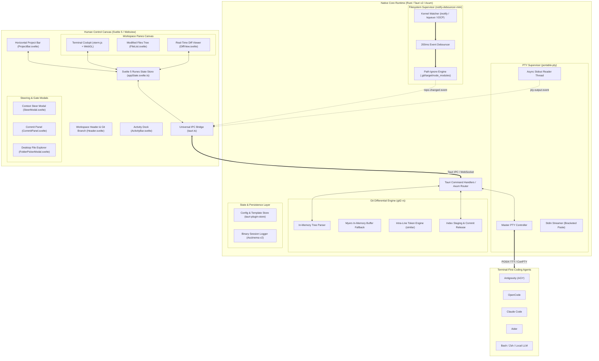
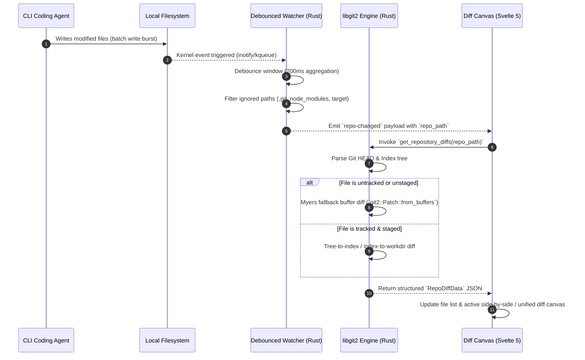

# 🏛️ AGENTDECK — COMPREHENSIVE TECHNICAL ARCHITECTURE
### *System Blueprint, Core Subsystems & Multi-Phase Architectural Evolution*

---

## 1. Executive Architectural Overview

**AgentDeck** is engineered as a high-performance, ultra-low memory desktop control harness for terminal-first AI coding agents (Google Antigravity, OpenCode, Claude Code, Aider, Gemini CLI, Goose Agent, and local LLM runners).

The architecture bridges the gap between **autonomous multi-file CLI agent execution** and **human-in-the-loop verification**, coupling an embedded pseudo-terminal (PTY) supervisor with an in-process Git differential engine and a horizontal multi-project navigation deck.

### Architectural Invariants:
1. **Zero-Latency Terminal Isolation:** Terminal PTY I/O streaming is processed on dedicated OS threads, fully decoupled from Git diff synthesis, filesystem debouncers, and UI rendering frames.
2. **Native In-Process Git (`libgit2`):** Git diff parsing, index tree modifications, and commits execute in-process via `git2-rs`, completely eliminating child process fork overhead and dangling `.git/index.lock` contention.
3. **Dual Runtime Parity:** The Svelte 5 frontend functions identically whether hosted inside the **Tauri v2** native desktop Webview shell or served over HTTP/WebSocket via the standalone **Rust Backend Server** (`server/`).
4. **Strict Memory Boundaries:** Idle memory footprint must remain `< 50MB` for single-project MVP (V1) and `< 90MB` under 3 concurrent multi-project PTY workloads (V2).

---

## 2. High-Level System Architecture



---

## 3. Core Subsystems Breakdown

### 3.1. PTY Supervisor & Terminal Cockpit (`portable-pty` + `@xterm/xterm`)

The PTY Supervisor manages the lifecycle, stream multiplexing, and terminal rendering of system shells and AI coding agents.

```
┌───────────────────────────────────────────────────────────────────────────────────────┐
│                                 PTY LIFECYCLE PIPELINE                                │
├───────────────────────────────────────────────────────────────────────────────────────┤
│ 1. Spawn Request: Tauri Command `create_pty(session_id, cwd, shell)`                  │
│ 2. System TTY Allocation: `portable_pty::native_pty_system().openpty(PtySize)`       │
│ 3. Child Command Spawn: Fork process with `LANG=en_US.UTF-8` & `LC_ALL=en_US.UTF-8`   │
│ 4. Non-Blocking Reader Loop: Dedicated OS thread polling master PTY buffer            │
│ 5. Event Stream: Chunks emitted via `app.emit("pty-output:{session_id}", data)`       │
│ 6. Frontend Render: `@xterm/xterm` WebGL canvas consumes UTF-8 with Unicode 11 addon  │
└───────────────────────────────────────────────────────────────────────────────────────┘
```

#### Evolution Across Milestones:
* **Version 1.0 (MVP) — Single/Multi-Session PTY:**
  * Uses `portable-pty` with isolated master/slave pairs.
  * Async reading loop on a background thread emitting to Tauri event channels.
  * WebGL GPU-accelerated rendering in `@xterm/xterm` with `@xterm/addon-unicode11` and `@xterm/addon-fit`.
  * Real-time agent detection scanning command invocations and stdout banners (`agy`, `antigravity`, `opencode`, `claude`, `aider`, `gemini`, `goose`).
* **Version 2.0 (Multi-Agent Control) — Multi-PTY Registry, Slot-Based Split Deck & Theme Synchronization:**
  * **Session Registry:** `Arc<Mutex<HashMap<SessionId, PtyProcess>>>` managed via Tokio channels with thread-safe lifecycle control and spawn idempotency.
  * **Unified Slot-Based DOM Mounting & Pool:** Each terminal session owns a persistent `HTMLDivElement` wrapper. Visible sessions are mounted directly into DOM slot containers (`pane1SlotElement`, `pane2SlotElement`), while background sessions reside in an offscreen zero-overhead pool (`hiddenPoolElement`), preserving 100% of WebGL canvas buffers and PTY output streaming across navigation.
  * **Interactive Multi-Pane Split Cockpit:** `TerminalView.svelte` supporting Single Pane, Side-by-Side Split Horizontal, and Stacked Split Vertical with draggable reactive resizing (`terminalSplitPercent`, 20%–80%).
  * **Integrated Pane Toolbars & State Isolation:** Independent toolbars for Pane 1 and Pane 2 with session switcher dropdowns, 1-click **Swap Panes** (`Alt+X`), **New Session in this Pane**, **Maximize to Single**, and **Close Session**.
  * **Targeted Session Injection & Steering:** `targetPane` routing (`'primary' | 'secondary' | 'auto'`) ensures prompt injection, Quick Launch, and agent spawns target the focused active pane without hijacking sibling panes.
  * **Cohesive Theme Engine & Viewport Harmony:** Synchronizes `--deck-border`, `--deck-card`, and `--deck-surface` palettes across Dracula, Nord, OneDark, GitHub Dark, and Light themes, with borderless canvas mounting, transparent viewport scrollbar tracks, and internal `8px 12px` text padding.
  * **Terminal Scroll Fidelity & TUI Compatibility:** Smart bottom pinning via `term.write` completion callbacks, direct container `wheel` listeners, and floating "Scroll to Bottom" buttons for seamless navigation in curses/Ink CLI agents (Antigravity CLI).
  * **Scoped Project Working Directory:** PTYs inherit their specific attached project directory (`cwd = project.path`).
* **Version 3.0 (Enterprise Platform) — Remote SSH & Containerized PTY:**
  * **SSH2 PTY Bridge:** Integrated `russh` / `ssh2` client allowing remote agent execution on cloud instances (EC2, GCP, remote workstations) over encrypted tunnels.
  * **Docker Container Harness:** `bollard` client attaching to Docker/Dev Container instances (`docker exec -it`) with remote volume synchronization.

---

### 3.2. Git & Differential Review Engine (`git2-rs` + In-Memory Myers Fallback)

The Differential Review Engine is designed to deliver real-time spatial awareness without spawning child processes.



#### Evolution Across Milestones:
* **Version 1.0 (MVP) — In-Process Myers Fallback Diffing:**
  * Scans status via `repo.statuses()`.
  * Computes line-by-line diffs using `git2::Patch::from_buffers` for newly created or untracked files.
  * Hunk-level staging (`stage_hunk`) and uncommitted rollback (`discard_hunk`, `discard_file`).
  * Direct commit release gate executing `repo.commit(...)` with signature verification.
* **Version 2.0 (Precision Review) — Intra-Line Token & Character Diffing:**
  * Integrates the `similar` crate to compute sub-line token changes within modified lines.
  * Visual token highlight layers with high-contrast rendering in `DiffView.svelte`.
  * Multi-repository diff routing for parallel attached projects.
  * Multi-extension filter chips with flex-wrapping and file search filter.
* **Version 3.0 (Time-Travel Diffs) — Binary Delta Streaming & Timeline Scrubbing:**
  * Binary session delta logging capturing every file state transition.
  * Interactive time-travel scrub bar (`TimeTravel.svelte`) allowing developers to step through historical agent iterations.

---

### 3.3. Human Steering & Context Injection Pipeline

The Human Steering loop translates visual review feedback into structured CLI prompts injected directly into the agent's interactive session.

```
┌───────────────────────────────────────────────────────────────────────────────────────┐
│                           STEERING CONTEXT PACKET INJECTION                           │
├───────────────────────────────────────────────────────────────────────────────────────┤
│ 1. Developer Selection: Mouse drag or Shift+Click across lines (e.g. Lines 42–48)     │
│ 2. Context Synthesis: Structured prompt packet generated in memory:                   │
│    [Human Review Feedback] File: src/auth.ts (Lines 42-48)                            │
│    Snippet:                                                                           │
│    + const token = req.headers.authorization;                                         │
│    + verifyToken(token);                                                              │
│    Feedback / Instruction: Validate JWT expiry before signature check.                │
│                                                                                       │
│ 3. 🛡️ Stdin Bracketed Paste Mode Encoding:                                            │
│    `\x1b[200~` + prompt_packet + `\x1b[201~` + `\r`                                   │
│                                                                                       │
│ 4. Non-Blocking PTY Injection: Streamed into `portable_pty` master stdin              │
│ 5. Safe Execution: Agent receives full block atomically without premature \n triggers │
└───────────────────────────────────────────────────────────────────────────────────────┘
```

#### Evolution Across Milestones:
* **Version 1.0 (MVP) — Multi-Line Selection & Bracketed Paste:**
  * Mouse drag and Shift+Click line range highlighting with floating action bar.
  * Agent safety gating: Warns before injecting into raw shells; provides 1-click agent launch shortcuts (*"Launch Antigravity & Steer"*).
  * Bracketed paste mode framing (`\x1b[200~` ... `\x1b[201~`) with `\r`.
* **Version 2.0 (Prompt Intelligence) — Templates & Context Presets:**
  * Reusable steering template engine (`{{file}}`, `{{lines}}`, `{{code}}`, `{{instructions}}`, `{{project}}`, `{{branch}}`).
  * Built-in **"Explain Code & Removal Impact"** template for deep architectural inquiries (function purpose, design rationale, and removal consequences).
  * 1-click context presets (*"Explain function & removal impact"*, *"Refactor & clean"*, *"Add unit tests"*, *"Fix bug & validation"*, *"Optimize performance"*, *"Security hardening"*).
  * Full-featured markdown preview and edit modal before terminal transmission.
* **Version 3.0 (Automated Governance) — Hooks & Model Context Protocol (MCP):**
  * **Automated Diagnostic Hooks:** Pre-steer linters (`eslint`, `cargo check`, `pytest`) automatically attach diagnostic error messages to steering prompts.
  * **MCP Server Bridge:** AgentDeck acts as an MCP host/tool provider, allowing connected agents to inspect live diff state and file trees directly.

---

### 3.4. Multi-Project Management & State Isolation Layer

The multi-project management subsystem allows developers to attach, monitor, and steer multiple codebases concurrently.

```
┌────────────────────────────────────────────────────────────────────────────────────────┐
│                        PARALLEL MULTI-PROJECT STATE ISOLATION                          │
├────────────────────────────────────────────────────────────────────────────────────────┤
│ AppState (Root Svelte 5 Store)                                                         │
│ ├── projects: ProjectItem[]                                                            │
│ │   ├── [Project A: /projects/client-ui]                                               │
│ │   │   ├── repoInfo: { branch: "main", dirty: 3, staged: 1 }                          │
│ │   │   ├── files: FileDiff[] (Scoped to Project A)                                    │
│ │   │   ├── sessions: PtySession[] (CWD = /projects/client-ui)                         │
│ │   │   └── selectedFilePath: "src/App.svelte"                                         │
│ │   │                                                                                  │
│ │   └── [Project B: /projects/server-api]                                              │
│ │       ├── repoInfo: { branch: "feat/jwt", dirty: 0, staged: 0 }                      │
│ │       ├── files: FileDiff[] (Scoped to Project B)                                    │
│ │       ├── sessions: PtySession[] (CWD = /projects/server-api)                        │
│ │       └── selectedFilePath: null                                                     │
│ │                                                                                      │
│ └── activeProjectId: "project-b" ◄── Instant zero-reload context switch                │
└────────────────────────────────────────────────────────────────────────────────────────┘
```

#### Key Mechanisms:
* **Parallel Execution:** PTY terminals, agent processes, and filesystem watchers in Project A continue executing in the background when the user switches focus to Project B.
* **Horizontal Project Bar (`ProjectBar.svelte`):** Sleek top tab bar rendering project folder names, active Git branch badges, real-time dirty file counters, active agent badges, and close (`x`) buttons.
* **Local Storage Persistence:** The project list and last active project index are stored in `localStorage` (`agentdeck_projects`), restoring workspaces automatically on startup.
* **Stacking Context Hierarchy:** Explicit z-index layers ensuring modal overlays (`z-50`), ActivityBar tooltips (`z-40`), Top Header and ProjectBar (`z-30`), and Terminal tabs (`z-20`) render consistently above WebGL canvases (`z-10`).

---

## 4. Architectural Evolution Matrix (V1 ➔ V2 ➔ V3)

| Architectural Dimension | Version 1.0 (MVP) — Baseline | Version 2.0 — Implemented & Verified | Version 3.0 — Future Vision |
| :--- | :--- | :--- | :--- |
| **Workspace Scope** | Single active Git repository | **Multi-Project Deck** (Horizontal navigation bar, parallel state isolation, 1-click attach) | Distributed Remote Workspaces (SSH / Docker / Cloud instances) |
| **Process Boundaries** | Local desktop process + child PTY shells | Local desktop process + concurrent PTY registry map with session persistence | Local UI + Remote daemon bridge + WASM plugin sandbox |
| **PTY Concurrency** | Multi-session tabs (single active CWD) | **Multi-PTY Registry & Canvas Pool** (Tokio channels, isolated CWD per project, persistent DOM pool) | **Remote PTY Protocol** (SSH2 tunnel, Docker exec multiplexer) |
| **Terminal Canvas** | `@xterm/xterm` + WebGL + Unicode 11 | Split layout deck (single, horizontal split, vertical split) + Smart TUI bottom pinning | Time-travel flight recorder & Asciinema replay viewer |
| **Git Diff Engine** | In-process `git2` + Myers buffer fallback | `similar` token intra-line diffing + flex filter chips + AI commit synth | Time-travel binary diff streaming & historical scrubber |
| **Context Steering** | Drag selection + Bracketed Paste injection | Reusable prompt templates, "Explain Code" template & 1-click presets | Automated pre/post edit linter hooks + Native MCP server |
| **State Persistence** | `localStorage` (Theme & UI flags) | `localStorage` (Projects, templates, LLM settings, active tabs) | Encrypted project workspace profiles & team playbooks |
| **Network Protocols** | Tauri IPC / Local WebSocket (Axum) | Tauri IPC / Local WebSocket (Axum) | SSH2, Docker Unix Socket, MCP JSON-RPC, WASM Extism |
| **Primary Rust Crates** | `portable-pty`, `git2`, `notify-debouncer-mini` | + `similar`, `tokio` channels | + `russh`, `bollard`, `extism`, `mcp-sdk` |
| **Memory Target** | **< 50MB RAM** (Idle baseline) | **< 90MB RAM** (3 active projects & PTYs) | **< 150MB RAM** (With remote SSH & recording) |
| **Cold Startup Time** | **< 400ms** | **< 500ms** | **< 800ms** |

---

## 5. Security, Sandboxing & Invariant Guardrails

1. **Local-First Boundary:** All code differential analysis and PTY interactions occur exclusively on the local machine with zero external cloud telemetry or unauthorized network egress.
2. **Safe Terminal Injections:** All steering feedback payloads injected into PTY stdin must enforce Bracketed Paste framing (`\x1b[200~` ... `\x1b[201~`) to eliminate terminal escape sequence injection attacks or accidental newline command executions.
3. **In-Process Git Concurrency:** Repository index operations in `git2-rs` must be protected by thread-safe Mutexes and write locks released immediately after index serialization (`index.write()`).
4. **Filesystem Event Isolation:** File watchers must aggressively filter system-generated build directories (`.git/`, `node_modules/`, `target/`, `.svelte-kit/`, `dist/`) to prevent infinite diff re-render loops.
